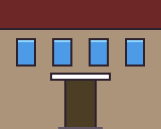

# Contributing art to Route 10

Route 10 is a little pixel-art game about Jefferson, Stamford, and Hobart —
meant to be painted by the people who actually live there. You don't need
to know how to code.

## What we're looking for

Right now, most of all: **building facades.** Every real business and
landmark starts as a plain placeholder box with its name on it, waiting for
someone who knows what it looks like to paint it in. See the list below for
what's still open.

Later we'll also want people — character sheets and portraits — but facades
come first, since they're what makes each village recognizably itself.

## How to paint one

Easiest: the in-browser **Studio**, which locks the canvas size and color
palette for you, so there's nothing to get wrong.

<https://tomhennen.github.io/mainstreet/studio/>

Pick the building you want, and it sets you up with a correctly-sized,
correctly-paletted canvas to draw on.

If you'd rather use a "real" pixel art tool, **Aseprite** (paid) or
**Piskel** (free, in-browser) both work — just follow the spec below by
hand.

### What good enough looks like

Here's a plain, ordinary building at the size and level of detail we're
hoping for — a flat wall, a roof band, a few windows, a door, a sign.
Nothing fancy; that's the point.

*This one was made by a computer to show size and detail. We won't put
computer art in the game; we'd rather have yours.*

Anything at this level of finish or better is very welcome — and rougher
first tries are welcome too. We'll help you get it over the line.

## The spec in plain words

- Everything sits on a **16×16 pixel grid** — like building out of little
  square bricks.
- Save as a **PNG** with a transparent background.
- **No smoothing or anti-aliasing** — turn it off if your tool defaults to
  it. Pixel art wants hard, clean edges.
- Use **only the colors in the game's palette.** The Studio locks this for
  you; in Aseprite or Piskel, load the palette file first and pick from it.
- **Width** = the building's footprint width in tiles, times 16 pixels.
- **Height** is a multiple of 16, and can be taller than the footprint —
  the art sits on the bottom of the canvas, and any extra rows above are
  where a roof, awning, or hanging sign goes.
- **You choose where the door goes.** Two little markers sit on the bottom
  row of the Studio's canvas, one for the door and one for the plaque, and
  you can put them in any column you like — drag them along the strip under
  the drawing, or use the ◀ ▶ buttons beside it. The game reads them for
  where a player knocks and where your name hangs. They're markers, not
  paint: they never appear in the picture.

Exact sizes for every open building are below.

## How to send it

The Studio's **Submit** button opens an email to
**tom.hennen+mainstreet@gmail.com** with a text code of your drawing
already in the body — just hit send. If you moved the door or the plaque, the
code brings that along, and the email says so in words as well.

Painted outside the Studio? Email that same address and attach the PNG. If
you'd like the door somewhere other than where the placeholder has it, just
say which column in the email — counting the tile columns across the front of
the building — and we'll set it that way.

Either way, include **the name you'd like credited.** We may nudge colors
or proportions slightly to fit, asking first for anything big — and your
name goes up as the painter regardless: on a small plaque beside the door of
the building you painted, where anyone walking past can read it, and on the
site's front page under the town you painted for. It doesn't appear in the
building's sign, so the story the game has to tell about the place stays
uninterrupted. The plaque itself is the game's own — you never have to paint
one, it goes on top of your art — but where it hangs is yours to choose.

## The kindness rule

Real businesses and places are drawn with the same affection we'd want for
our own storefront:

- No pasting in real logos or trademarked signage — paint your own take on
  the place instead.
- No real private people appear without their own say-so first.
- Keep it warm. If in doubt, make it kinder.

## Where AI fits

The game's code, maps, and tools get built with AI help — that's normal
here. The art that ships in the towns doesn't: no model-generated pixel art
goes into a world pack. Every facade, character, and portrait is painted by
a person. If AI helped you get there behind the scenes — turning a photo of
a building into a plan you then finished by hand, say — that's fine, and
your credit can say so, in your own words. An unpainted building stays a
plain placeholder box until someone paints it. That's not a gap to patch
quickly; it's the invitation this whole project runs on.

## Licenses

- The game's code is Apache 2.0 — see [`LICENSE`](LICENSE).
- Art and world content, including everything you contribute, is Creative
  Commons Attribution 4.0 — see [`LICENSE-CONTENT.md`](LICENSE-CONTENT.md).
  In short: anyone may copy, share, adapt and use it, commercially too, as
  long as they credit the creator — exactly what `credits.json` and the
  "painted by ___" credit it feeds are for.

## Buildings waiting for an artist

Middle Brook Cafe has its first coat (thank you, Tom and Lana). Every
building below is still a placeholder box, and any of them is up for grabs:

| Building | Village | Size (pixels) |
| --- | --- | --- |
| Jefferson Town Hall (`jefferson-town-hall`) | Jefferson | 80 × 48 |
| Mill Pond Inn (`mill-pond-inn`) | Jefferson | 80 × 48 |
| Heartbreak Hotel (`heartbreak-hotel`) | Jefferson | 80 × 48 |
| Stewart's (`stewarts`) | Stamford | 96 × 64 |
| Mac-A-Doodles (`mac-a-doodles`) | Stamford | 64 × 48 |
| Stamford Coffee (`stamford-coffee`) | Stamford | 80 × 48 |
| The Belvedere (`the-belvedere`) | Stamford | 80 × 48 |
| Cellar Door Wines (`cellar-door-wines`) | Hobart | 80 × 48 |

These are minimums — width is fixed by the footprint, but add extra rows
above for a roofline, sign, or anything that makes it feel like the real
place.

---

If you want to work on the code instead, start with [`CLAUDE.md`](CLAUDE.md).
